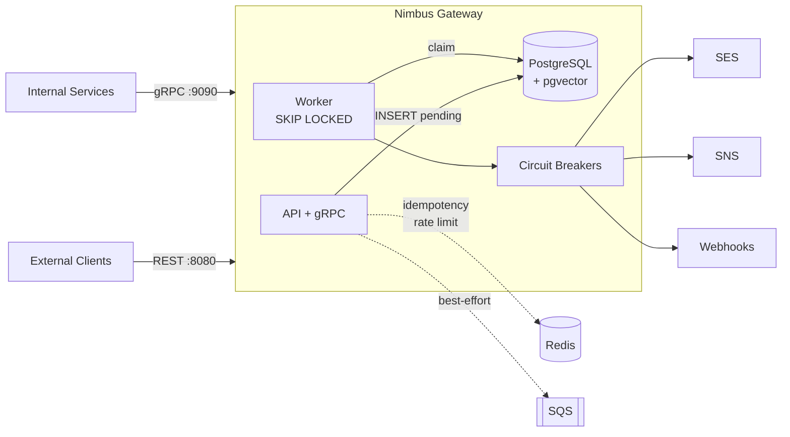

<div align="center">

# 🌩️ Nimbus

**A multi-tenant notification orchestration platform in Go.**

Durably accept notification requests over **REST + gRPC**, and deliver them across **email, SMS, and
webhook** channels with retries, dead-lettering, idempotency, rate limiting, circuit breaking, and an
optional **AI/RAG** layer.

[](https://go.dev)
[](https://grpc.io)
[](https://www.postgresql.org)
[](https://redis.io)
[](https://aws.amazon.com)
[](https://www.terraform.io)

[Quick Start](#-quick-start) · [Architecture](docs/ARCHITECTURE.md) · [API Reference](docs/API.md) · [Design Decisions](docs/ARCHITECTURE.md#15-key-design-decisions--tradeoffs)

</div>

---

## What is Nimbus?

Nimbus solves one hard problem well: **accept a notification request and guarantee it is eventually
delivered (or explicitly dead-lettered), across multiple channels, for thousands of independent
tenants — exactly once.**

It is built around a **transactional outbox**: every request is written to PostgreSQL *before* the
client is acknowledged, then a background worker claims and delivers it. The database is the single
source of truth; the message queue is an optimization, never a dependency.



> 📐 **For system-design depth — C4 diagrams, sequence flows, state machines, scaling math, failure
> modes, and tradeoff tables — read the [Architecture Deep Dive](docs/ARCHITECTURE.md).**

---

## ✨ Features

| Capability | Detail |
|---|---|
| **Dual transport** | REST/JSON (`:8080`) for external clients, gRPC/Protobuf (`:9090`) for internal services. |
| **Durable, exactly-once-ish delivery** | Transactional outbox + `FOR UPDATE SKIP LOCKED` claiming → safe horizontal scaling with no distributed locks. |
| **Multi-channel** | Email (AWS SES), SMS (AWS SNS), Webhook (HTTP POST), routed by a multi-sender. |
| **Retries & backoff** | Exponential-ish backoff (1m → 5m → 15m), max 5 attempts. |
| **Dead Letter Queue** | Failed messages quarantined with inspect / retry / discard endpoints. |
| **Idempotency** | Redis-backed; auto content-hash keys (5 min) + client keys (24 h, Stripe-style). |
| **Rate limiting** | Sliding-window per tenant (100 req/min) via Redis sorted sets. |
| **Circuit breakers** | Per-channel Closed/Open/HalfOpen FSM; one provider outage can't cascade. |
| **Server-streaming gRPC** | Push live delivery updates instead of client polling (~90% fewer requests). |
| **AI compose** | Natural language → notifications via LLM function calling. |
| **RAG Q&A** | pgvector hybrid search (vector + full-text, RRF) + rerank + injection/PII guards + cited answers. |
| **Observability** | Prometheus metrics, structured zap logs, health + circuit-status endpoints. |
| **Infra as Code** | Terraform for ECS Fargate, RDS, ElastiCache, SQS/SNS, ECR, Secrets Manager. |

---

## 🏗️ Tech Stack

| Layer | Technology |
|---|---|
| Language | Go 1.23 |
| HTTP | Chi router + middleware |
| RPC | gRPC + Protocol Buffers |
| Datastore | PostgreSQL (pgxpool) + **pgvector** (HNSW) |
| Cache / coordination | Redis (go-redis/v9) |
| Messaging | AWS SQS (+ DLQ), SNS |
| Email | AWS SES |
| AI | OpenAI (gpt-4o-mini + text-embedding-3-small) |
| Observability | Prometheus, zap |
| Packaging | Docker, docker-compose |
| Infrastructure | Terraform (AWS ECS Fargate) |

---

## 🚀 Quick Start

### Option A — Docker Compose (recommended)

Spins up the gateway, PostgreSQL (with auto-migrations), and Redis:

```bash
docker compose up --build
# Gateway → http://localhost:8080  (REST)  ·  localhost:9090  (gRPC)
```

### Option B — Run locally

```bash
# 1. Start dependencies (Postgres + Redis)
docker compose up -d postgres redis

# 2. Run the gateway
make dev          # or: go run ./cmd/gateway/main.go
```

### Smoke test

```bash
# Health
curl http://localhost:8080/health        # → OK

# Create a notification
curl -X POST http://localhost:8080/v1/notifications \
  -H "Content-Type: application/json" \
  -d '{
    "tenant_id": "00000000-0000-0000-0000-000000000001",
    "user_id":   "00000000-0000-0000-0000-000000000002",
    "channel":   "email",
    "payload":   { "to": "user@example.com", "subject": "Hi", "body": "Hello" }
  }'

# List them
curl "http://localhost:8080/v1/notifications?tenant_id=00000000-0000-0000-0000-000000000001"
```

> 📖 Full endpoint and gRPC reference: **[docs/API.md](docs/API.md)**.

---

## ⚙️ Configuration

All configuration is via environment variables (sensible defaults for local dev).

| Variable | Default | Description |
|---|---|---|
| `PORT` | `8080` | HTTP/REST port. |
| `GRPC_PORT` | `9090` | gRPC port. |
| `ENV` / `LOG_LEVEL` | `development` / `info` | Runtime env and log verbosity. |
| `DB_HOST` `DB_PORT` `DB_USER` `DB_PASSWORD` `DB_NAME` `DB_SSLMODE` | localhost:5432 | PostgreSQL connection. |
| `REDIS_HOST` `REDIS_PORT` `REDIS_PASSWORD` `REDIS_DB` | localhost:6379 | Redis (optional — degrades gracefully). |
| `AWS_REGION` `SES_FROM_EMAIL` | us-east-1 | Email via SES. |
| `SNS_REGION` | us-east-1 | SMS via SNS. |
| `SQS_QUEUE_URL` `SQS_DLQ_URL` `SQS_REGION` | — | SQS fast path (optional). |
| `OPENAI_API_KEY` `OPENAI_MODEL` | — / `gpt-4o-mini` | Enables AI compose + RAG. |
| `GRPC_AUTH_TOKENS` | `dev-token-nimbus:...0001` | `token:tenant` pairs, comma-separated. |

---

## 🔌 API Surface

| Method | Endpoint | Description |
|---|---|---|
| `POST` | `/v1/notifications` | Create a notification (idempotent). |
| `GET` | `/v1/notifications` | List by tenant (paginated). |
| `GET` | `/v1/notifications/{id}` | Get one. |
| `PATCH` | `/v1/notifications/{id}/status` | Update status. |
| `GET` | `/v1/dlq` · `/v1/dlq/{id}` | Inspect dead-lettered items. |
| `POST` | `/v1/dlq/{id}/retry` · `/discard` | Recover or abandon. |
| `POST` | `/v1/ai/compose` | Natural language → notifications. |
| `POST` | `/v1/ai/ask` | RAG question answering with citations. |
| `GET` | `/health` · `/v1/health/circuits` | Liveness + circuit-breaker state. |
| `GET` | `/metrics` | Prometheus metrics. |

**gRPC** (`notification.v1.NotificationService`): `CreateNotification`, `GetNotification`,
`StreamDeliveryUpdates` (server-streaming). See [docs/API.md](docs/API.md#grpc-api).

---

## 🧪 Testing

```bash
make test            # run all tests (verbose)
make test-quick      # fast, no verbose
make test-cover      # coverage → coverage.html
make lint            # golangci-lint
make ci-local        # deps + lint + test + build
```

Manual testing: import the Postman collection in [postman/](postman/) or use the cURL snippets above.

---

## 📦 Deployment

Production infrastructure is defined with **Terraform** in [terraform/](terraform/) — VPC across two
AZs, an ALB, ECS Fargate tasks, RDS PostgreSQL, ElastiCache Redis, SQS/SNS, ECR, and Secrets Manager.
Database migrations run as a one-shot ECS task from a dedicated `migrator` image.

```bash
make build           # static linux binary → bin/gateway
make docker-build    # container image
cd terraform && terraform init && terraform apply
```

See the [deployment topology diagram](docs/ARCHITECTURE.md#12-deployment-topology-aws) for the full picture.

---

## 🗂️ Project Structure

```
nimbus/
├── cmd/gateway/             # Composition root — wires everything together
├── proto/notification/v1/   # gRPC contract (.proto + generated Go)
├── internal/
│   ├── api/                 # REST handlers + middleware (rate limit)
│   ├── grpc/                # gRPC server + auth interceptors
│   ├── worker/              # Poll loop + multi-channel senders (SES/SNS/webhook)
│   ├── circuitbreaker/      # Per-channel circuit breaker FSM
│   ├── db/                  # Repository pattern + models (Postgres)
│   ├── redis/               # Idempotency + sliding-window rate limiter
│   ├── sqs/                 # SQS producer/consumer
│   ├── ai/                  # LLM compose + content enrichment
│   ├── rag/                 # Embed · hybrid search · rerank · guard · pipeline
│   ├── metrics/             # Prometheus instrumentation
│   ├── observ/              # Structured logging (zap)
│   └── config/              # Env-based configuration
├── migrations/              # SQL migrations (incl. pgvector / knowledge_base)
├── terraform/               # AWS infrastructure as code
├── ai-integration/          # Python RAG eval (RAGAS) + agent tooling
├── postman/                 # Postman collection for manual testing
└── docs/                    # ARCHITECTURE.md · API.md · guides
```

---

## 📚 Documentation

- **[Architecture Deep Dive](docs/ARCHITECTURE.md)** — C4 diagrams, sequence flows, state machines, scaling, failure modes, and design tradeoffs.
- **[API Reference](docs/API.md)** — every REST endpoint + the gRPC contract.
- [AWS Setup](docs/AWS_SETUP.md) · [Multi-Channel](docs/MULTI_CHANNEL.md) · [Migrations](docs/migrations.md)
- [AI Integration & RAGAS Eval](ai-integration/README.md)
- [Postman Guide](postman/README.md)

---

<div align="center">
<sub>Built with Go · Designed for durability, observability, and horizontal scale.</sub>
</div>
