# Nimbus — Architecture Deep Dive

> A multi-tenant **notification orchestration platform** written in Go. It accepts notification
> requests over REST and gRPC, durably persists them, and delivers them across **email, SMS, and
> webhook** channels with retries, dead-lettering, idempotency, rate limiting, circuit breaking,
> and an optional **AI/RAG** layer for natural-language operations.

This document is the canonical system-design reference. It is written as an **onboarding and
design guide** — every major decision includes the *why* and the *tradeoff*, not just the *what*.

---

## Table of Contents

1. [System at a Glance](#1-system-at-a-glance)
2. [C4 Level 1 — System Context](#2-c4-level-1--system-context)
3. [C4 Level 2 — Container View](#3-c4-level-2--container-view)
4. [C4 Level 3 — Internal Components](#4-c4-level-3--internal-components)
5. [Data Model (ERD)](#5-data-model-erd)
6. [Request Lifecycle — Create a Notification](#6-request-lifecycle--create-a-notification)
7. [The Background Worker](#7-the-background-worker)
8. [Notification State Machine](#8-notification-state-machine)
9. [Reliability Patterns](#9-reliability-patterns)
10. [gRPC & Server-Streaming](#10-grpc--server-streaming)
11. [The AI / RAG Subsystem](#11-the-ai--rag-subsystem)
12. [Deployment Topology (AWS)](#12-deployment-topology-aws)
13. [Scaling & Capacity Planning](#13-scaling--capacity-planning)
14. [Failure Modes & Mitigations](#14-failure-modes--mitigations)
15. [Key Design Decisions & Tradeoffs](#15-key-design-decisions--tradeoffs)
16. [Design Principles Summary](#16-design-principles-summary)

---

## 1. System at a Glance

Nimbus solves one hard problem well: **"accept a notification request and guarantee it is
eventually delivered exactly once (or explicitly dead-lettered), across multiple channels, for
thousands of independent tenants."**

| Concern | How Nimbus handles it |
|---|---|
| **Durability** | Every request is written to Postgres *before* we acknowledge the client (transactional outbox). The DB is the single source of truth. |
| **At-least-once delivery** | A worker claims pending rows and retries with exponential backoff until success or max attempts. |
| **No duplicate sends across replicas** | Rows are claimed with `FOR UPDATE SKIP LOCKED` — each worker gets a disjoint batch. |
| **Idempotent writes** | Redis-backed idempotency keys collapse client retries into a single notification. |
| **Fair multi-tenancy** | Sliding-window rate limiting per tenant; every query is tenant-scoped. |
| **Downstream resilience** | Each channel sender is wrapped in a circuit breaker that fails fast when a provider is down. |
| **Poison-message safety** | After N failures a notification moves to a Dead Letter Queue for inspection / manual retry. |
| **Observability** | Prometheus metrics, structured zap logs, health + circuit-status endpoints. |
| **Operability via natural language** | Optional AI compose endpoint + a RAG pipeline that answers questions grounded in your own data. |

**Tech stack:** Go 1.23 · Chi (HTTP) · gRPC + Protobuf · PostgreSQL + pgvector · Redis · AWS
(SES / SNS / SQS) · Prometheus · Docker · Terraform (ECS Fargate).

---

## 2. C4 Level 1 — System Context

Who talks to Nimbus, and what does Nimbus talk to?

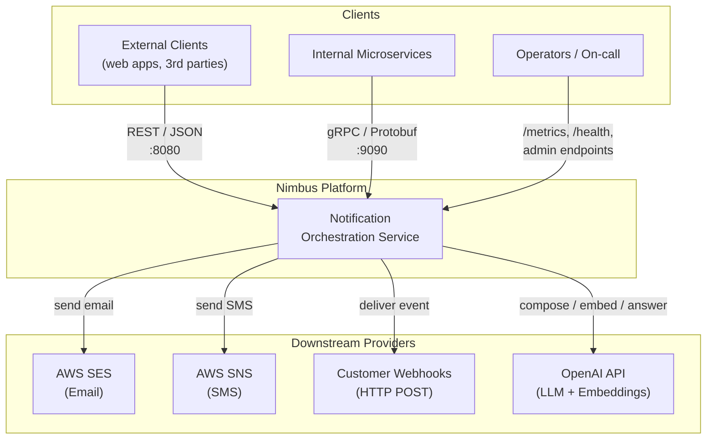

**Design note:** REST is the public front door for external clients; gRPC is the internal
hallway between our own services. Same business logic, two transports chosen per audience —
JSON for ubiquity, Protobuf for typing, binary efficiency, and streaming.

---

## 3. C4 Level 2 — Container View

Zooming in: the deployable units and the stateful systems they depend on. The API process and the
worker run **in the same binary today** (a goroutine) but are designed to split into independent
deployments without code changes.

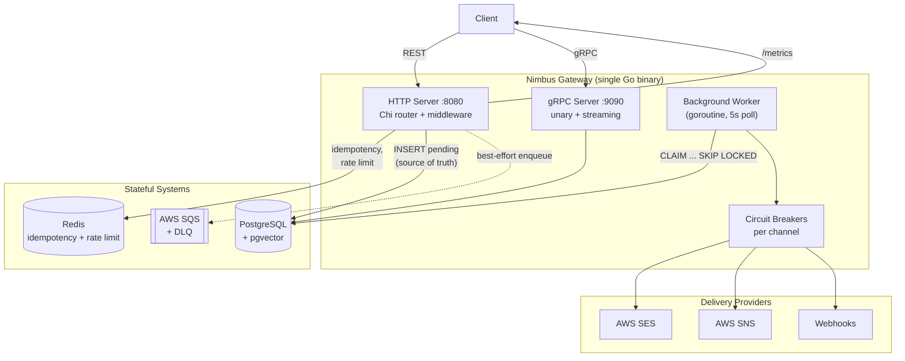

**Key insight (transactional outbox):** the HTTP handler writes the durable Postgres row first,
then tries SQS as a *best-effort* fast path. If SQS is down we still return `201` — the worker's
DB poll guarantees delivery. **SQS is an optimization, not a dependency.**

---

## 4. C4 Level 3 — Internal Components

The Go package layout maps cleanly onto responsibilities. Arrows show compile-time dependencies.

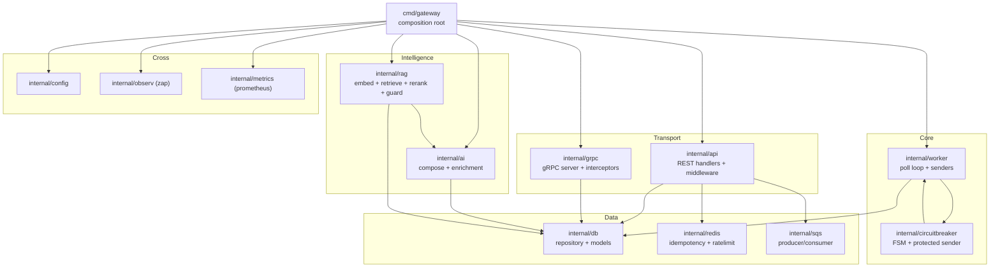

**Design note:** Each consumer defines its own narrow repository interface (e.g. the gRPC
server's `NotificationRepository` only declares the two methods it needs). That's interface
segregation — it keeps packages loosely coupled and trivially mockable in tests.

---

## 5. Data Model (ERD)

Three tables carry the system. All are tenant-scoped.

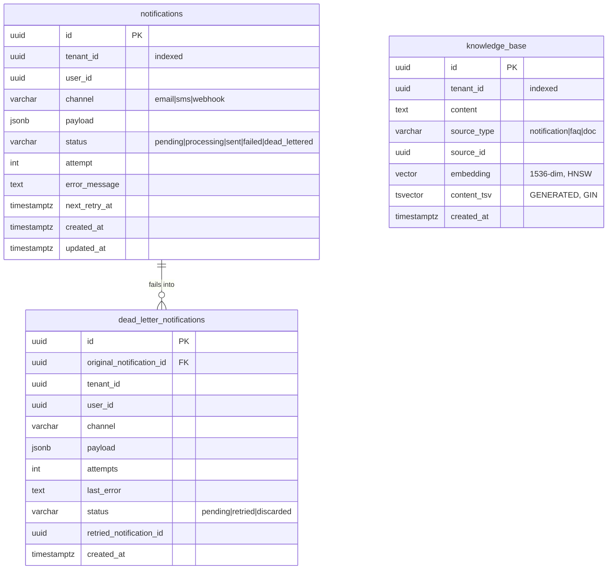

**Indexing strategy:**

- `idx_notifications_retry (status, next_retry_at, created_at) WHERE status IN ('pending','processing')`
  — a **partial index**. The worker's hot query only scans rows that can actually be claimed, so
  the index stays tiny even when millions of `sent` rows accumulate.
- `idx_notifications_tenant (tenant_id, created_at DESC)` — powers tenant list views with no sort.
- `knowledge_base` carries **two** ANN/search indexes: an **HNSW** index for vector similarity and a
  **GIN** index on the generated `content_tsv` column for full-text — this is what makes *hybrid*
  retrieval possible in a single SQL query.

---

## 6. Request Lifecycle — Create a Notification

The most important flow in the system. Note where durability is established and where idempotency
and rate limiting intercept.

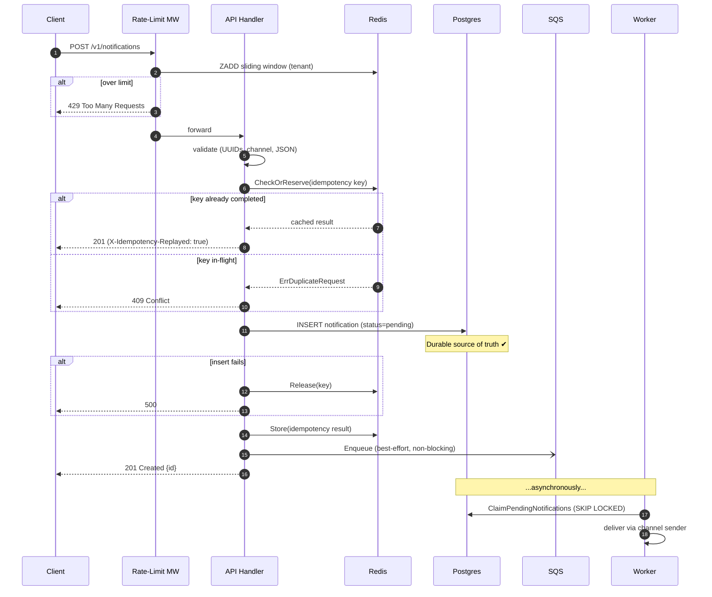

**Three key properties of this flow:**

1. **Durability boundary:** we return `201` only after the Postgres `INSERT`. The client's
   acknowledgement is a promise we can keep even if everything downstream crashes.
2. **Idempotency release on failure:** if the DB write fails *after* we reserved the key, we
   `Release()` it so the client's retry isn't poisoned with a false `409` for 5 minutes.
3. **Best-effort enqueue:** the `-)` (async) arrow to SQS never blocks the response and never fails
   the request.

---

## 7. The Background Worker

The worker is a simple, robust poll loop. Its correctness rests entirely on the atomic claim.

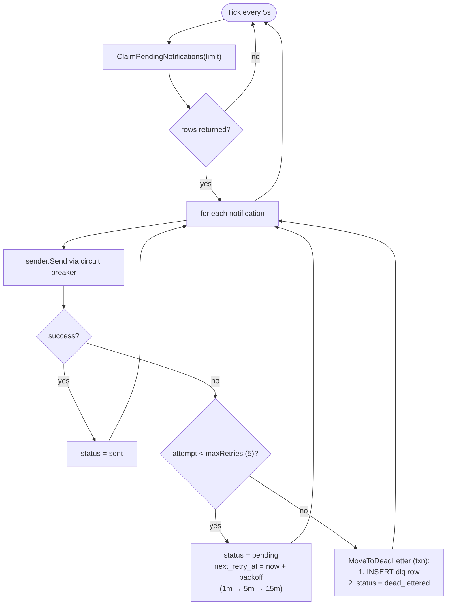

### The atomic claim — the heart of horizontal scalability

```sql
UPDATE notifications
SET status = 'processing', updated_at = NOW()
WHERE id IN (
    SELECT id FROM notifications
    WHERE (status = 'pending' AND (next_retry_at IS NULL OR next_retry_at <= NOW()))
       OR (status = 'processing' AND updated_at < NOW() - INTERVAL '5 minutes') -- reclaim stuck rows
    ORDER BY created_at
    LIMIT $1
    FOR UPDATE SKIP LOCKED          -- ⚡ the magic
)
RETURNING ...;
```

- **`FOR UPDATE SKIP LOCKED`** lets N worker replicas pull **disjoint** batches concurrently with
  zero coordination — no Redis lock, no leader election. Postgres is the coordinator.
- **Stuck-row reclamation:** if a worker crashes mid-send, its row is stranded in `processing`.
  The `OR processing older than 5m` clause lets a healthy worker reclaim it — self-healing, no
  manual intervention.
- **Claim = mark processing in one statement:** there's no read-then-write race window, so the
  same row can never be sent twice by two replicas.

**Design note:** This is a database-as-queue pattern. Exactly-once-ish claiming comes for free
from Postgres' row locking, which removes an entire class of distributed-locking bugs. The tradeoff
is polling latency (up to 5s) — acceptable for notifications, and the SQS fast path covers the
latency-sensitive case.

---

## 8. Notification State Machine

Every notification walks this graph. Terminal states are `sent`, `dead_lettered`, and `discarded`.

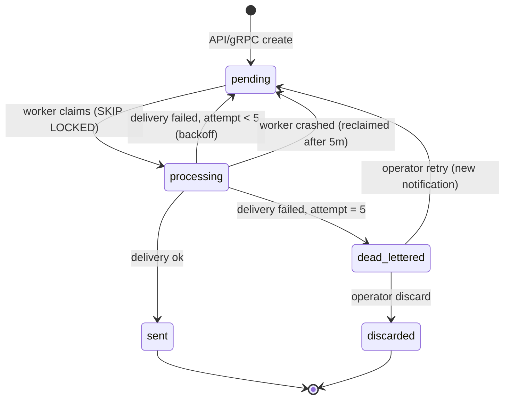

The retry edge `processing → pending` carries an **exponential-ish backoff** (`1m, 5m, 15m`,
capped) stamped into `next_retry_at`, so the worker won't re-pick the row until the delay elapses.

---

## 9. Reliability Patterns

Nimbus stacks four independent safety mechanisms. Each is small; together they make the system
production-grade.

### 9.1 Idempotency (Redis)

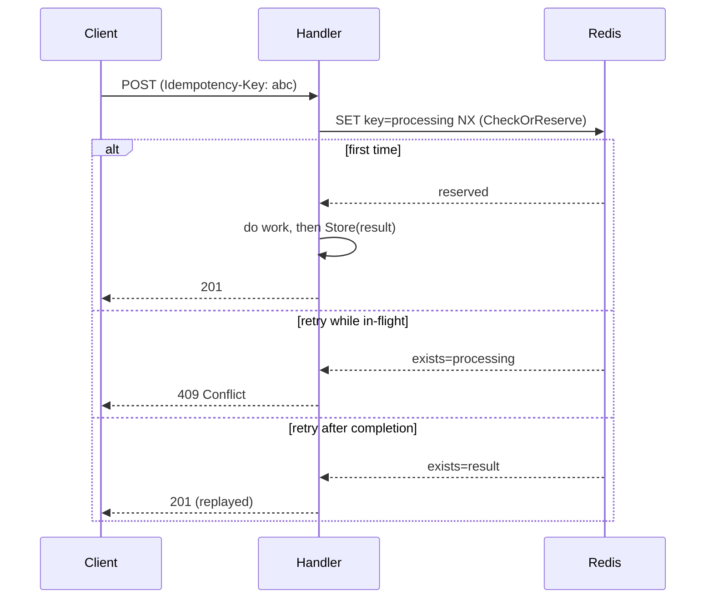

- **Auto keys (5 min TTL):** if the client sends no key, we hash `tenant|user|channel|payload`.
  This catches accidental network retries without blocking intentional re-sends.
- **Client keys (24 h TTL):** explicit `Idempotency-Key` header → Stripe-style strong dedup.
- **Compare-and-delete release:** `Release()` only deletes the key if it's still the `processing`
  marker (Lua CAS), so it can never clobber a stored result.

### 9.2 Sliding-Window Rate Limiting (Redis Sorted Sets)

Per-tenant **100 req/min**. We store request timestamps in a `ZSET`, trim everything older than the
window with `ZREMRANGEBYSCORE`, then `ZCARD` to count. Unlike a fixed window, this has **no
burst-at-boundary** problem — a true rolling 60-second view.

### 9.3 Circuit Breaker (per channel)

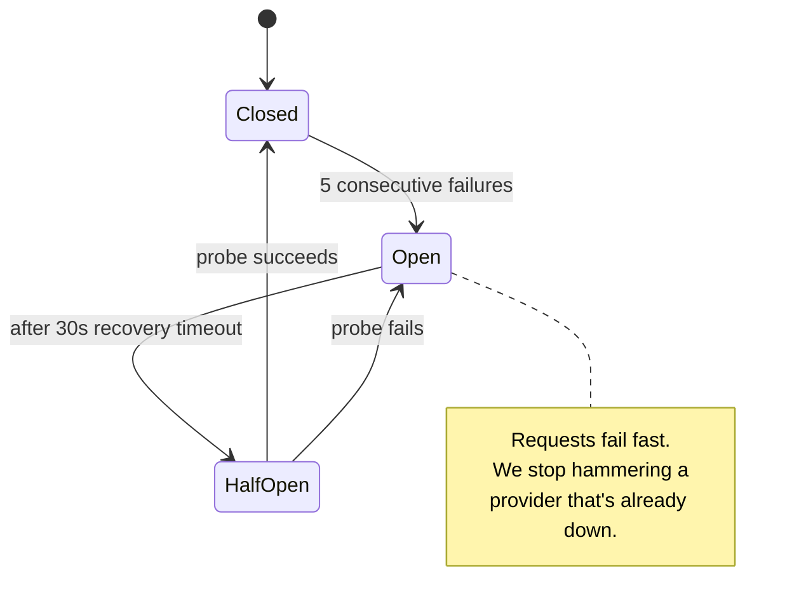

Each sender (SES / SNS / webhook) gets its own breaker, so an SMS outage never blocks email.
`GET /v1/health/circuits` exposes live state; `POST /v1/admin/circuits/{name}/reset` forces a probe.

### 9.4 Dead Letter Queue

After 5 failed attempts a notification is moved to `dead_letter_notifications` **inside a
transaction** (insert DLQ row + flip source status atomically). Operators can inspect, **retry**
(creates a fresh notification), or **discard** via the `/v1/dlq` endpoints.

---

## 10. gRPC & Server-Streaming

Internal services use gRPC for typing, efficiency, and — the headline feature — **server-streaming
delivery updates**.

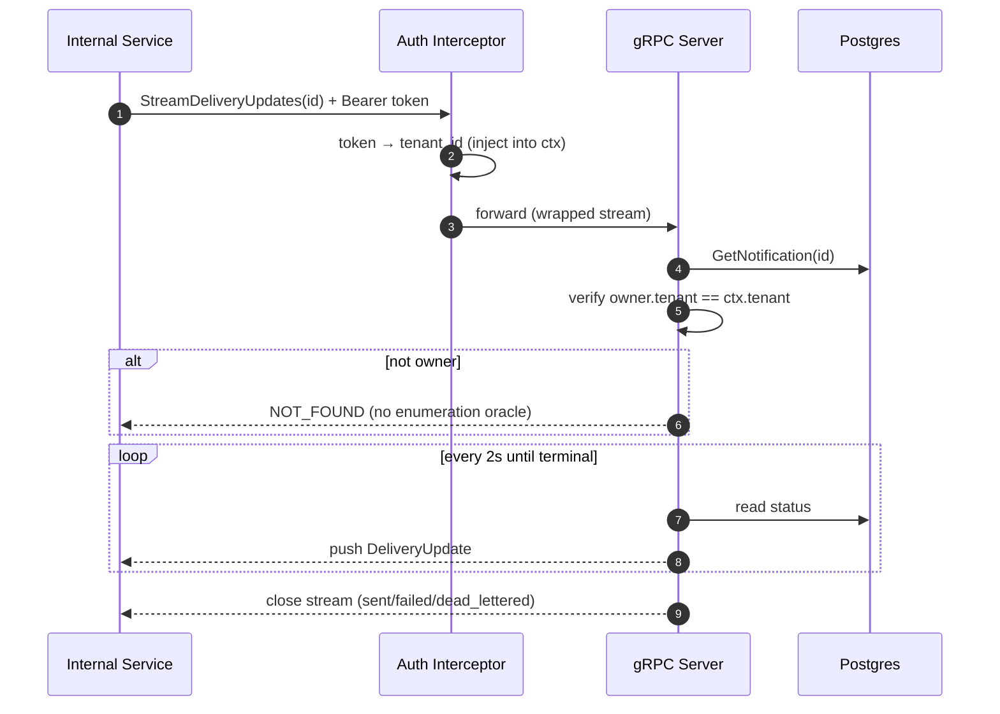

**Why streaming beats polling:** client-side polling fires *one request per interval* regardless of
whether anything changed. Server-streaming inverts control — **one** request, the server pushes only
the cadence it chooses. On a 100K-events/day system that eliminates thousands of redundant requests.

**Security (IDOR defense):** the tenant is taken from the **authenticated token**, never the request
body. Cross-tenant reads return `NOT_FOUND` (not `PERMISSION_DENIED`) so an attacker can't use the
error to discover which IDs exist. This maps to **OWASP API1: Broken Object Level Authorization**.

---

## 11. The AI / RAG Subsystem

Optional (enabled when `OPENAI_API_KEY` is set). Two capabilities:

1. **Compose** (`POST /v1/ai/compose`) — natural language → notifications via LLM function calling.
2. **Ask** (`POST /v1/ai/ask`) — a full **Retrieval-Augmented Generation** pipeline that answers
   questions grounded in the tenant's own notification history, with citations.

```mermaid
flowchart LR
    q["User query"] --> guard1["1. Injection guard<br/>(regex, fail fast)"]
    guard1 --> mask["2. PII mask<br/>email/phone/SSN → tokens"]
    mask --> embed["3. Embed<br/>text-embedding-3-small (1536-d)"]
    embed --> hybrid["4. Hybrid search<br/>vector + full-text → RRF (k=60)<br/>top-20 candidates"]
    hybrid --> rerank["5. Rerank<br/>cross-encoder → top-5"]
    rerank --> prompt["6. Build prompt<br/>numbered context 1..5 + question"]
    prompt --> llm["7. LLM answer<br/>system prompt pinned"]
    llm --> restore["8. Restore PII<br/>tokens → real values"]
    restore --> ans["Cited answer"]
```

**Design highlights:**

- **Hybrid retrieval + Reciprocal Rank Fusion:** vector search nails *semantic* matches; full-text
  (BM25-style) nails *exact keyword* matches. RRF fuses them by **rank position**
  ($\text{score}(d) = \sum_i \frac{1}{k + \text{rank}_i(d)}$, $k=60$) so we never need the two systems
  to share a score scale. Best of both, in one SQL query.
- **Two-stage retrieval (recall → precision):** cheap hybrid search casts a wide net (top-20), then
  a more expensive reranker picks the precise top-5. Standard IR pattern.
- **Defense in depth:** a regex guard *and* a pinned system prompt. Even if an injection slips past
  the guard, the system prompt instructs the model to ignore instruction-overrides.
- **PII never reaches OpenAI:** masking happens *before* the embedding and chat calls; real values
  are restored only in the final local response.
- **pgvector over a dedicated vector DB:** we already run Postgres, so we get ACID, one backup
  strategy, and the ability to JOIN vectors with relational data — zero new infrastructure.

---

## 12. Deployment Topology (AWS)

Provisioned with **Terraform** (`/terraform`). Production target is **ECS Fargate** behind an ALB,
with managed Postgres, Redis, and SQS.

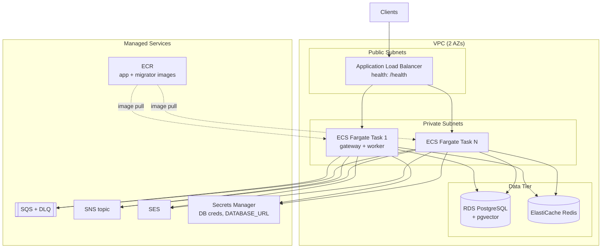

- **Migrations** run as a separate one-shot ECS task from a dedicated `migrator` image — schema
  changes are decoupled from app rollout.
- **Secrets** (DB password, connection string) live in **Secrets Manager**, injected as env vars —
  never baked into images or Terraform state in plaintext.
- CI/CD via **GitHub Actions** (`.github/`) builds, tests, pushes to ECR, and updates the service.

---

## 13. Scaling & Capacity Planning

| Dimension | Current | How it scales |
|---|---|---|
| **API throughput** | 1 task | Stateless → add ECS tasks behind the ALB. |
| **Worker throughput** | in-process goroutine | Split into its own deployment; `SKIP LOCKED` means N workers need **zero** coordination. |
| **Write durability** | single RDS | Multi-AZ failover; read replicas for list endpoints. |
| **Rate-limit / idempotency** | single Redis | Cluster mode; keys are already namespaced by tenant. |
| **Vector search** | HNSW in Postgres | Good to ~tens of millions of vectors before a dedicated ANN store is warranted. |

**Back-of-envelope:** at **100K notifications/day ≈ 1.16/sec average**. The SQS enqueue path is
~500 ns of CPU per message and the DB claim batches 10 rows per 5s tick per worker — so a *single*
worker already has ~80× headroom, and the design scales horizontally well past that.

---

## 14. Failure Modes & Mitigations

| Failure | Blast radius | Mitigation |
|---|---|---|
| SQS unavailable | none | Best-effort enqueue; DB-poll path still delivers. |
| Redis unavailable | degraded | Idempotency + rate limiting disabled, requests still served (logged warn). |
| A provider (e.g. SES) down | that channel only | Circuit breaker opens → fail fast → retries/DLQ; other channels unaffected. |
| Worker crash mid-send | one batch | Row stuck in `processing` is reclaimed after 5 min by another worker. |
| Poison message (always fails) | one notification | Moves to DLQ after 5 attempts; never blocks the queue. |
| Duplicate client retry | none | Idempotency key collapses it to one notification. |
| Two workers, same row | none | `FOR UPDATE SKIP LOCKED` guarantees disjoint claims. |
| Prompt injection (AI) | none | Regex guard + pinned system prompt (defense in depth). |
| PII leak to OpenAI | none | Masked before any external API call. |

---

## 15. Key Design Decisions & Tradeoffs

> Each decision below names the alternative that was considered and the cost that was accepted.

| Decision | Why | Tradeoff we accepted |
|---|---|---|
| **Transactional outbox** (DB first, SQS best-effort) | Durability without a distributed transaction across DB + queue | Up to 5s extra latency on the slow path (covered by the SQS fast path) |
| **DB-as-queue with `SKIP LOCKED`** | Exactly-once claiming, horizontal scaling, no extra infra | Polling latency; not suited to millions of msgs/sec (we're far below that) |
| **Two ports: REST :8080 + gRPC :9090** | Clean protocol separation; no h2c multiplexing complexity | Two listeners to operate |
| **Per-channel circuit breakers** | Isolate provider failures | More breaker state to monitor |
| **Idempotency in Redis, not DB unique constraint** | Sub-ms checks, TTL-based expiry, no schema bloat | Redis becomes a soft dependency (gracefully degraded) |
| **pgvector, not Pinecone/Weaviate** | Zero new infra, ACID, JOIN vectors with relational data | ~10s-of-millions vector ceiling |
| **Hybrid search + RRF** | Robust across semantic *and* keyword queries | Slightly more complex SQL than pure-vector |
| **Server-streaming gRPC for status** | ~90% fewer requests vs polling | gRPC-only feature (REST clients still poll) |
| **`NOT_FOUND` on cross-tenant access** | No enumeration oracle (OWASP API1) | Slightly less precise error for legitimate 404s |

---

## 16. Design Principles Summary

The core principles that drive the system's design:

- **The database is the source of truth and the queue.** Outbox pattern + `FOR UPDATE SKIP LOCKED`
  gives durability and lock-free horizontal scaling in one move.
- **SQS is an optimization, not a dependency.** If it's down, the DB poll still delivers; a write is
  never failed because a queue hiccupped.
- **Idempotency is two-tier.** Auto content-hash keys (5 min) for accidental retries, explicit
  client keys (24 h) for strong dedup — the same model Stripe uses.
- **Sliding window, not fixed window.** Redis sorted sets eliminate the boundary-burst problem.
- **Circuit breakers are per-channel.** A single provider outage can't cascade to the other channels.
- **Crashes self-heal.** Stuck `processing` rows are reclaimed after 5 minutes.
- **RAG is grounded and guarded.** Hybrid retrieval + RRF for relevance; regex guard + pinned
  prompt + PII masking for safety; citations for verifiability.
- **Security is tenant-from-token, never tenant-from-body.** Closes the IDOR hole and returns
  `NOT_FOUND` to avoid leaking IDs.

---

*See also: [README](../README.md) for quick start, and [API Reference](API.md) for endpoint and
gRPC contract details.*
